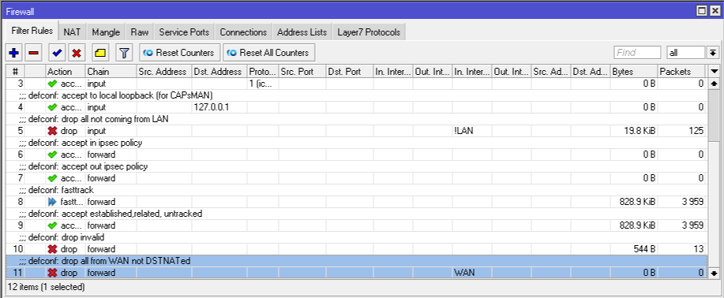

# MikroTik Default Configuration

 Apa itu default configuration? Default configuration adalah konfigurasi awal yang disediakan saat kita membeli MikroTik. Apa saja yang telah dikonfigurasikan dalam Default Configuration? Berikut adalah penjelasan mengenai apa saja yang telah dikonfigurasikan secara default dalam Default Configuration dari MikroTik.

 

 Mikrotik dengan konfigurasi default tidak akan bisa diakses via ether1 karena pada Firewall terdapat Filter Rules yang mendrop semua chain input ke ether1, sehingga MAC Address tidak dapat terdeteksi pada WinBox.
 
 

 

 Selanjutnya gunakan topologi di bawah, akses mikrotik via ether2/ ether3/ ether4

 

 Saat menggunakan MikroTik baru, akses via WinBox akan menampilkan keterangan konfigurasi default dari pabrik seperti pada gambar berikut.

 

 Pada gambar di atas, diperlihatkan beberapa konfigurasi default MikroTik, klik OK. Berikut rincian konfigurasi default MikroTik:

# Router Mode:
 ⦁	Port1 / ether1 / WAN port di lindungi oleh firewall (lihat gambar firewall > filter rules, di atas) dan DHCP Client = enabled

 

 ⦁	Wireless menjadi bagian dari LAN bridge
 

⦁	IP Address LAN = 192.168.88.1/24 > ip default mikrotik
 

# Konfigurasi WLAN 1:
 ⦁	Mode ap-bridge\
 ⦁	Band 2ghz-b/g/n\
 ⦁	Ht-chains 0,1\
 ⦁	Ht extension 20/40mhz-Ce

 
#  Konfigurasi LAN:
 ⦁	Group switch: ether2(master), ether3, ether4

 ⦁	DHCP Server = enabled

 ⦁	DNS = enabled
 

 Konfigurasi WAN (gateway):\
 ⦁	Gateway = ether1\
 ⦁	Firewall = enabled\
 ⦁	NAT = enabled
 
 

Keuntungan dari default configuration mikrotik ini adalah:\
 ⦁	User bisa langsung terkoneksi ke internet dengan memasang kabel WAN ke port1, dan LAN ke port2, 3, dan/atau 4. Untuk wireless juga bisa langsung terkoneksi ke internet. Agar aman, beri pengamanan pada security profil nya.\
 ⦁	MikroTik sudah dikonfigurasi firewall nya sehingga aman/secure dari gangguan luar.

Kesimpulan :\
 ⦁	MikroTik memudahkan user awam, jika user ingin langsung terkoneksi ke internet tanpa melakukan konfigurasi dari nol.\
 ⦁	Default configuration MikroTik ini juga sangat dianjurkan untuk user awam, karena sudah dikonfigurasi untuk koneksi ke internet juga firewall nya, sehingga aman/secure dari gangguan luar.

Sekian yang dapat saya sampaikan, mohon maaf apabila ada salah kata atau kekurangan dalam penyampaian. Akhir kata, Wassalam
